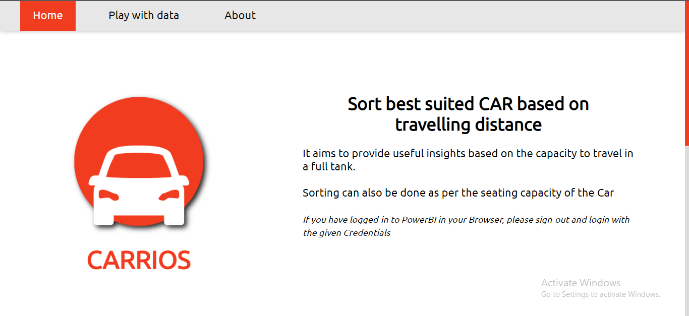
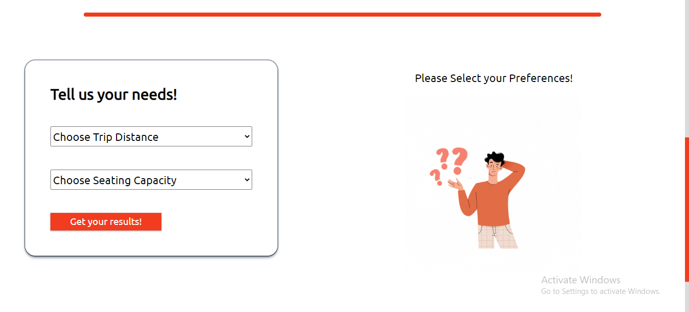
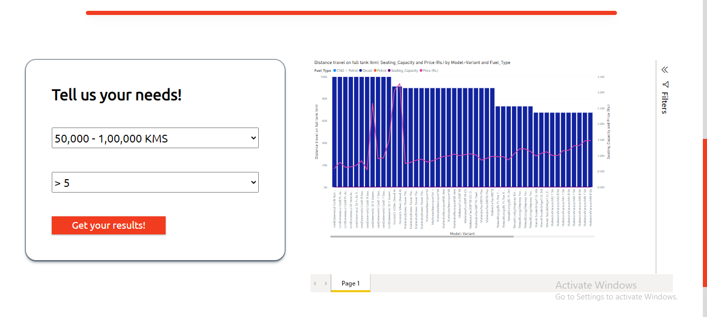
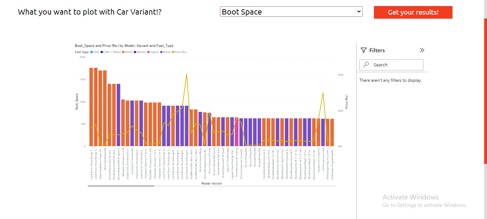
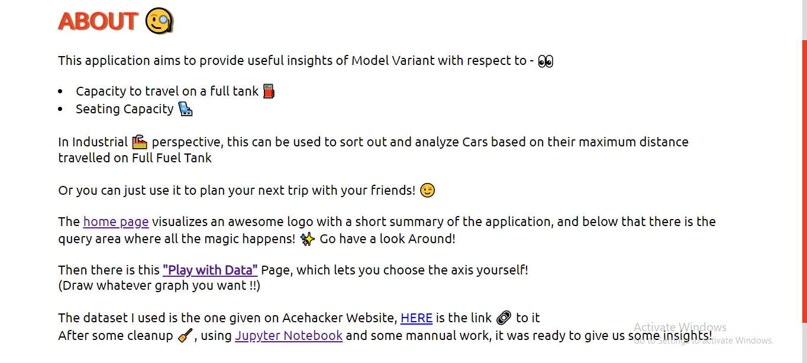

# CARRIOS

A Data Analysis application developed under Microsoft Engage'22, which aims to provide useful insights of Model Variant with respect to -

- Capacity to travel on a full tank ⛽

- Seating Capacity 💺

---

In Industrial 🏭 perspective, this can be used to sort out and analyze Cars based on their maximum distance travelled on Full Fuel Tank

Or you can just use it to plan your next trip with your friends! 😉

# Dataset Used

I have used the dataset readily provided on the Acehacker Website with the challenge, [here](https://acehacker.com/microsoft/engage2022/cars_engage_2022.csv) is the link to it.

As a first step, I've cleaned the dataset using [Jupyter Notebook](https://github.com/harshit-sharma-gits/CARRIOS/blob/master/notebook.ipynb) and some mannual work using Microsoft Excel

> Currently used Dataset is uploaded [here](https://docs.google.com/spreadsheets/d/1Oo9nP74S4bT3kZk3J-Lkda9g99j1uzRm/edit?usp=sharing&ouid=111692908854284428822&rtpof=true&sd=true)

Now the dataset is imported in Microsoft Power BI, on which graphs are made as per the data specified, and then they are embedded in my website

# Tech Stack Used

All the code is written in raw HTML, CSS, and JavaScript

The basic idea of the app is to get the data which user wants to see, then import it directly form PowerBI, for the user to see

## Screenshots of the App

# Deployment

The app is deployed on GitHub Pages, you can see it here : [DEPLOYMENT](https://harshit-sharma-gits.github.io/CARRIOS/)